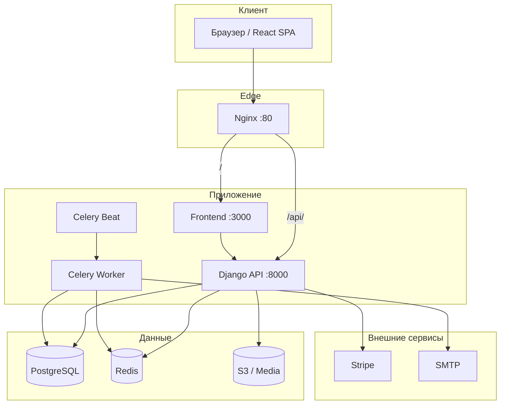

<div align="center">

# FarmDirect

**Маркетплейс «ферма — стол»: свежие продукты напрямую от местных фермеров, без посредников и с полным контролем цепочки поставок.**

[](https://www.python.org/)
[](https://www.djangoproject.com/)
[](https://www.django-rest-framework.org/)
[](https://react.dev/)
[](https://www.postgresql.org/)
[](https://redis.io/)
[](https://docs.celeryq.dev/)

[](https://docs.docker.com/compose/)
[](https://nginx.org/)
[](https://stripe.com/)
[](LICENSE)

</div>

---

## Содержание

1. [О проекте](#1-о-проекте)
2. [Ключевые возможности](#2-ключевые-возможности)
3. [Технологический стек](#3-технологический-стек)
4. [Структура репозитория](#4-структура-репозитория)
5. [Архитектура и как это работает](#5-архитектура-и-как-это-работает)
6. [Доменная модель (крупными блоками)](#6-доменная-модель-крупными-блоками)
7. [Сервисы в Docker Compose](#7-сервисы-в-docker-compose)
8. [Быстрый старт (локально, Docker)](#8-быстрый-старт-локально-docker)
9. [Основные команды Docker Compose](#9-основные-команды-docker-compose)
10. [Ручной запуск frontend и backend](#10-ручной-запуск-frontend-и-backend)
11. [Конфигурация и переменные окружения](#11-конфигурация-и-переменные-окружения)
12. [API, очереди и интеграции](#12-api-очереди-и-интеграции)
13. [Мониторинг и эксплуатация](#13-мониторинг-и-эксплуатация)
14. [CI/CD](#14-cicd)
15. [Безопасность и хранение медиа](#15-безопасность-и-хранение-медиа)
16. [Роли компонентов в продакшене](#16-роли-компонентов-в-продакшене)
17. [Лицензия](#17-лицензия)
18. [Поддержка](#18-поддержка)

---

## 1. О проекте

**FarmDirect** — это production-ready платформа маркетплейса, соединяющая **местных фермеров** напрямую с **покупателями**. Система устраняет посредников: фермеры получают справедливую цену, а потребители — свежие сезонные продукты с доставкой на дом или самовывозом с фермы.

Платформа рассчитана на три аудитории:

| Аудитория | Интерфейс | Задачи |
|-----------|-----------|--------|
| **Покупатели** | React SPA | Каталог, корзина, заказы, подписки, отзывы |
| **Фермеры** | Панель + REST API | Управление фермой, товарами, заказами, сертификатами |
| **Интеграторы** | OpenAPI / JWT | Автоматизация заказов, аналитика, внешние сервисы |

### Что это за тип системы?

FarmDirect — **распределённая многосервисная платформа**, а не монолитный скрипт. Бизнес-логика разделена между Django API, React-клиентом, фоновыми воркерами Celery и reverse-proxy Nginx.

| Аспект | Описание |
|--------|----------|
| **Продукт** | B2C/B2B маркетплейс farm-to-table: каталог, заказы, подписки, доставка, отзывы |
| **Архитектура** | Django REST API + React SPA + Celery workers + Nginx |
| **Данные** | PostgreSQL (метаданные и транзакции) + Redis (кэш и брокер) + локальное/S3-хранилище (медиа) |
| **Платежи** | Stripe (покупатели и Connect-аккаунты фермеров) |

---

## 2. Ключевые возможности

### Для покупателей

- **Сезонный каталог** — товары с привязкой к сезону, предзаказом и актуальным наличием на складе
- **Профили ферм** — описание, галерея, геолокация, радиус доставки, минимальная сумма заказа
- **Корзина и оформление** — разовые заказы с доставкой или самовывозом
- **Подписочные боксы** — еженедельные / раз в две недели / ежемесячные наборы с настройкой предпочтений
- **Отзывы и рейтинги** — оценки ферм и отдельных продуктов, ответы фермеров
- **Календарь урожая** — что в сезоне, ожидаемые даты сбора, доступность для предзаказа

### Для фермеров

- **Панель фермера** — управление фермой, каталогом, остатками и заказами
- **Сертификации** — USDA Organic, GAP, Non-GMO, Fair Trade и др. с проверкой срока действия
- **Инвентаризация** — остатки, порог низкого запаса, единицы измерения (фунт, корзина, ящик…)
- **Stripe Connect** — приём платежей на привязанный аккаунт фермера

### Для платформы (фоновые процессы)

- **Email-уведомления** — подтверждение заказа, напоминания о доставке
- **Автоотмена** — неоплаченные заказы старше 24 часов с возвратом остатков
- **Рекуррентные подписки** — ежедневная генерация боксов по расписанию Celery Beat

---

## 3. Технологический стек

| Слой | Технология | Назначение |
|------|------------|------------|
| **Backend** | Django 5.1 + DRF 3.15 | REST API, ORM, админка |
| **Аутентификация** | SimpleJWT | JWT access / refresh токены |
| **Frontend** | React 18 + Redux Toolkit | SPA, состояние, маршрутизация |
| **HTTP-клиент** | Axios | Запросы к API |
| **База данных** | PostgreSQL 16 | Пользователи, заказы, каталог |
| **Кэш / брокер** | Redis 7 | Celery broker, result backend |
| **Очереди** | Celery 5.4 + django-celery-beat | Фоновые задачи и cron |
| **Документация API** | drf-spectacular | OpenAPI 3 + Swagger UI |
| **Платежи** | Stripe | Checkout, подписки, Connect |
| **Медиа (prod)** | django-storages + boto3 | AWS S3 (опционально) |
| **Прокси** | Nginx 1.25 | Маршрутизация, статика, gzip |
| **Контейнеризация** | Docker Compose 3.9 | Локальная и prod-сборка |
| **WSGI (prod)** | Gunicorn | Многопроцессный Django |
| **Мониторинг** | Sentry SDK | Трекинг ошибок (опционально) |

---

## 4. Структура репозитория

```
FarmDirect/
├── backend/
│   ├── apps/
│   │   ├── accounts/        # User, FarmerProfile, ConsumerProfile, JWT-регистрация
│   │   ├── farms/           # Farm, сертификаты, галерея, календарь урожая
│   │   ├── products/        # Категории, FarmProduct, сезонная доступность
│   │   ├── orders/          # Order, OrderItem, DeliverySchedule, Celery-задачи
│   │   ├── subscriptions/   # Планы, боксы, рекуррентные заказы
│   │   └── reviews/         # Отзывы, ответы фермеров
│   ├── config/
│   │   ├── settings/        # base, development, production
│   │   ├── urls.py          # Маршрутизация API
│   │   ├── celery.py          # Конфигурация Celery
│   │   └── wsgi.py
│   ├── utils/               # Пагинация, обработка исключений
│   ├── manage.py
│   └── requirements.txt
├── frontend/
│   ├── public/
│   └── src/
│       ├── api/             # auth, farms, products, subscriptions
│       ├── components/      # auth, farms, products, layout, subscription
│       ├── pages/           # Dashboard, Settings
│       ├── store/             # Redux: auth, cart
│       ├── hooks/           # useAuth
│       └── styles/          # globals.css
├── nginx/
│   └── nginx.conf           # Reverse proxy: /api → backend, / → frontend
├── docker-compose.yml
├── .env.example
└── README.md
```

---

## 5. Архитектура и как это работает



### Типовой сценарий: заказ с доставкой

1. Покупатель добавляет товары в корзину (Redux `cartSlice`).
2. Frontend отправляет `POST /api/orders/` с JWT в заголовке.
3. Backend создаёт `Order`, резервирует остатки, инициирует Stripe Payment Intent.
4. Celery-задача `send_order_confirmation` отправляет email.
5. Фермер обновляет статус → `DeliverySchedule` с датой и временным слотом.
6. Celery Beat ежедневно вызывает `send_delivery_reminders` за сутки до доставки.

---

## 6. Доменная модель (крупными блоками)

### Пользователи и роли (`accounts`)

| Сущность | Описание |
|----------|----------|
| `User` | Email-логин, роли: `consumer` / `farmer` / `admin` |
| `FarmerProfile` | Ферма, адрес, геокоординаты, Stripe Account ID |
| `ConsumerProfile` | Адрес доставки, диетические предпочтения, Stripe Customer ID |

### Фермы (`farms`)

| Сущность | Описание |
|----------|----------|
| `Farm` | Профиль, радиус доставки, pickup/delivery, минимальный заказ |
| `FarmPhoto` | Галерея изображений |
| `FarmCertification` | Organic, GAP, Non-GMO и др. с датами и документами |
| `HarvestCalendar` | Сезонность урожая по месяцам |

### Каталог (`products`)

| Сущность | Описание |
|----------|----------|
| `Category` | Иерархические категории (овощи, фрукты, молочка…) |
| `FarmProduct` | Цена, единица, остаток, флаги organic / non-GMO |
| `SeasonalAvailability` | Сезон, предзаказ, ожидаемая дата |

### Заказы (`orders`)

| Сущность | Описание |
|----------|----------|
| `Order` | UUID, статус (pending → delivered), Stripe PI |
| `OrderItem` | Снимок цены/названия на момент заказа |
| `DeliverySchedule` | Дата, слот (утро / день / вечер), трекинг |

### Подписки (`subscriptions`)

| Сущность | Описание |
|----------|----------|
| `SubscriptionPlan` | Частота (weekly / biweekly / monthly), размер бокса |
| `SubscriptionBox` | Активная подписка с предпочтениями и исключениями |
| `SubscriptionOrder` | Конкретная поставка, сгенерированная Celery |

### Отзывы (`reviews`)

| Сущность | Описание |
|----------|----------|
| `Review` | 1–5 звёзд, привязка к ферме **или** продукту |
| `ReviewReply` | Ответ фермера или администратора |

---

## 7. Сервисы в Docker Compose

| Сервис | Образ / сборка | Порт | Назначение |
|--------|----------------|------|------------|
| `db` | `postgres:16-alpine` | 5432 | Основная БД |
| `redis` | `redis:7-alpine` | 6379 | Брокер Celery, кэш |
| `backend` | `./backend` | 8000 | Django + Gunicorn (4 workers) |
| `celery_worker` | `./backend` | — | Фоновые задачи |
| `celery_beat` | `./backend` | — | Планировщик (DatabaseScheduler) |
| `frontend` | `./frontend` | 3000 | React dev-server / build |
| `nginx` | `nginx:1.25-alpine` | 80, 443 | Единая точка входа |

**Volumes:** `postgres_data`, `redis_data`, `static_volume`, `media_volume`

---

## 8. Быстрый старт (локально, Docker)

### Требования

- Docker Engine 24+
- Docker Compose v2
- Git

### Запуск за 5 шагов

```bash
# 1. Клонировать репозиторий
git clone https://github.com/NodirOdilov/FarmDirect.git
cd FarmDirect

# 2. Создать конфигурацию
cp .env.example .env
# Отредактируйте SECRET_KEY, пароли БД, ключи Stripe при необходимости

# 3. Собрать и запустить стек
docker compose up --build -d

# 4. Применить миграции (если не выполнились автоматически)
docker compose exec backend python manage.py migrate

# 5. Создать суперпользователя
docker compose exec backend python manage.py createsuperuser
```

### Точки доступа

| Сервис | URL |
|--------|-----|
| **Веб-приложение** | http://localhost |
| **API** | http://localhost/api/ |
| **Админ-панель** | http://localhost/api/admin/ |
| **Swagger UI** | http://localhost/api/docs/ |
| **OpenAPI Schema** | http://localhost/api/schema/ |
| **Frontend (напрямую)** | http://localhost:3000 |
| **Backend (напрямую)** | http://localhost:8000 |

---

## 9. Основные команды Docker Compose

| Команда | Описание |
|---------|----------|
| `docker compose up -d` | Запустить все сервисы в фоне |
| `docker compose up --build -d` | Пересобрать образы и запустить |
| `docker compose down` | Остановить и удалить контейнеры |
| `docker compose down -v` | Остановить + удалить volumes (⚠️ потеря данных БД) |
| `docker compose logs -f backend` | Логи Django API |
| `docker compose logs -f celery_worker` | Логи воркера |
| `docker compose exec backend python manage.py migrate` | Миграции |
| `docker compose exec backend python manage.py createsuperuser` | Админ |
| `docker compose exec backend python manage.py test` | Тесты backend |
| `docker compose exec frontend npm test` | Тесты frontend |
| `docker compose exec backend python manage.py collectstatic --noinput` | Статика |

---

## 10. Ручной запуск frontend и backend

Подходит для активной разработки без полной пересборки Docker.

### Backend

```bash
cd backend
python -m venv venv

# Windows
venv\Scripts\activate
# Linux / macOS
source venv/bin/activate

pip install -r requirements.txt
set DJANGO_SETTINGS_MODULE=config.settings.development   # Windows
# export DJANGO_SETTINGS_MODULE=config.settings.development  # Linux/macOS

python manage.py migrate
python manage.py runserver
```

### Frontend

```bash
cd frontend
npm install
npm start
```

> Убедитесь, что `REACT_APP_API_URL` в `.env` указывает на работающий backend (по умолчанию `http://localhost:8000/api`).

### Celery (отдельный терминал)

```bash
cd backend
celery -A config worker -l info
celery -A config beat -l info --scheduler django_celery_beat.schedulers:DatabaseScheduler
```

---

## 11. Конфигурация и переменные окружения

Полный шаблон — в файле [`.env.example`](.env.example).

### Критичные переменные

| Переменная | Назначение | Пример |
|------------|------------|--------|
| `DJANGO_SETTINGS_MODULE` | Профиль настроек | `config.settings.development` |
| `SECRET_KEY` | Криптографический ключ Django | длинная случайная строка |
| `DEBUG` | Режим отладки | `True` / `False` |
| `ALLOWED_HOSTS` | Разрешённые хосты | `localhost,127.0.0.1` |
| `POSTGRES_*` | Подключение к PostgreSQL | см. `.env.example` |
| `REDIS_URL` | Кэш Django | `redis://redis:6379/0` |
| `CELERY_BROKER_URL` | Брокер задач | `redis://redis:6379/1` |
| `CORS_ALLOWED_ORIGINS` | CORS для SPA | `http://localhost:3000` |
| `REACT_APP_API_URL` | Base URL для Axios | `http://localhost/api` |

### Интеграции (опционально)

| Переменная | Сервис |
|------------|--------|
| `STRIPE_PUBLIC_KEY` / `STRIPE_SECRET_KEY` / `STRIPE_WEBHOOK_SECRET` | Платежи |
| `AWS_ACCESS_KEY_ID` / `AWS_SECRET_ACCESS_KEY` / `AWS_STORAGE_BUCKET_NAME` | S3 для медиа |
| `SENTRY_DSN` | Мониторинг ошибок |
| `EMAIL_HOST` / `EMAIL_HOST_USER` / `EMAIL_HOST_PASSWORD` | SMTP-рассылка |

---

## 12. API, очереди и интеграции

### REST API (основные эндпоинты)

| Эндпоинт | Методы | Описание |
|----------|--------|----------|
| `/api/auth/register/` | `POST` | Регистрация пользователя |
| `/api/auth/login/` | `POST` | Получение JWT-пары |
| `/api/auth/token/refresh/` | `POST` | Обновление access-токена |
| `/api/accounts/profile/` | `GET`, `PUT`, `PATCH` | Профиль текущего пользователя |
| `/api/farms/` | `GET`, `POST` | Список / создание ферм |
| `/api/farms/{id}/` | `GET`, `PUT`, `PATCH`, `DELETE` | Детали фермы |
| `/api/products/` | `GET`, `POST` | Каталог продуктов |
| `/api/products/{id}/` | `GET`, `PUT`, `PATCH`, `DELETE` | Карточка продукта |
| `/api/orders/` | `GET`, `POST` | Управление заказами |
| `/api/orders/{id}/` | `GET`, `PUT`, `PATCH` | Детали заказа |
| `/api/subscriptions/plans/` | `GET` | Тарифные планы подписок |
| `/api/subscriptions/boxes/` | `GET`, `POST` | Подписочные боксы |
| `/api/reviews/` | `GET`, `POST` | Отзывы |

> Интерактивная документация: **Swagger UI** → `/api/docs/`

### Celery-задачи

| Задача | Модуль | Триггер |
|--------|--------|---------|
| `send_order_confirmation` | `orders.tasks` | После создания заказа |
| `send_delivery_reminders` | `orders.tasks` | Ежедневно (Beat) |
| `auto_cancel_unpaid_orders` | `orders.tasks` | Ежедневно (Beat) |
| `process_pending_subscriptions` | `subscriptions.tasks` | Ежедневно (Beat) |
| `_send_subscription_order_email` | `subscriptions.tasks` | После генерации бокса |

### Внешние интеграции

- **Stripe** — оплата заказов, рекуррентные подписки, Connect для фермеров
- **SMTP** — транзакционные письма (подтверждения, напоминания)
- **AWS S3** — хранение изображений и документов сертификации в production
- **Sentry** — агрегация исключений backend

---

## 13. Мониторинг и эксплуатация

### Рекомендуемый стек observability

| Инструмент | Назначение |
|------------|------------|
| **Sentry** | Ошибки Django / Celery (`SENTRY_DSN`) |
| **Prometheus + Grafana** | Метрики Gunicorn, PostgreSQL, Redis |
| **Loki / ELK** | Централизованные логи Nginx и приложения |
| **Uptime Kuma / Pingdom** | Проверка доступности `/api/` |

### Healthcheck в Docker Compose

Сервисы `db` и `redis` имеют встроенные healthcheck — `backend`, `celery_worker` и `celery_beat` стартуют только после готовности зависимостей.

### Резервное копирование

```bash
# Дамп PostgreSQL
docker compose exec db pg_dump -U farmdirect farmdirect > backup_$(date +%Y%m%d).sql

# Восстановление
docker compose exec -T db psql -U farmdirect farmdirect < backup_20260517.sql
```

---

## 14. CI/CD

В репозитории CI-пайплайн пока не настроен. Рекомендуемая схема для GitHub Actions:

```yaml
# .github/workflows/ci.yml (рекомендация)
# ├── lint + test backend (python manage.py test)
# ├── lint + test frontend (npm test -- --watchAll=false)
# ├── build Docker images
# └── deploy to staging / production
```

**Чеклист перед деплоем:**

- [ ] `DEBUG=False`, сильный `SECRET_KEY`
- [ ] `DJANGO_SETTINGS_MODULE=config.settings.production`
- [ ] Настроены `ALLOWED_HOSTS` и `CORS_ALLOWED_ORIGINS`
- [ ] SSL/TLS на Nginx (порты 443, сертификаты Let's Encrypt)
- [ ] S3 для медиа, отдельный managed PostgreSQL
- [ ] Stripe webhook endpoint в production
- [ ] Sentry DSN и алерты

---

## 15. Безопасность и хранение медиа

### Аутентификация и авторизация

- **JWT** (SimpleJWT): короткоживущий access + refresh токен
- **Ролевая модель**: `consumer`, `farmer`, `admin` — разграничение на уровне API
- **CORS**: явный whitelist origins в production

### Данные и медиа

| Тип | Development | Production |
|-----|-------------|------------|
| Метаданные | PostgreSQL (Docker) | Managed PostgreSQL + бэкапы |
| Изображения | `media_volume` / локальный диск | AWS S3 через `django-storages` |
| Статика | WhiteNoise + Nginx | CDN + `collectstatic` |

### Практики безопасности

- Никогда не коммитьте `.env` с реальными ключами
- Webhook Stripe — только с проверкой `STRIPE_WEBHOOK_SECRET`
- `client_max_body_size 100M` в Nginx — лимит загрузки файлов
- Верификация сертификатов ферм (`is_verified`) — ручная модерация через админку

---

## 16. Роли компонентов в продакшене

```
                    ┌─────────────────────────────────────┐
   Internet ───────►│  Nginx (TLS termination, gzip)     │
                    └──────────┬────────────┬─────────────┘
                               │            │
                    ┌──────────▼──┐  ┌──────▼──────────┐
                    │  React SPA  │  │  Django + DRF   │
                    │  (static/CDN)│  │  (Gunicorn)    │
                    └─────────────┘  └────────┬─────────┘
                                              │
              ┌───────────────────────────────┼────────────────────┐
              │                               │                    │
     ┌────────▼────────┐            ┌─────────▼────────┐   ┌───────▼───────┐
     │  PostgreSQL     │            │  Redis           │   │  AWS S3       │
     │  (primary DB)  │            │  (broker/cache)  │   │  (media)      │
     └─────────────────┘            └─────────┬────────┘   └───────────────┘
                                              │
                                   ┌──────────▼──────────┐
                                   │  Celery Worker      │
                                   │  Celery Beat        │
                                   └─────────────────────┘
```

| Компонент | Масштабирование | Примечание |
|-----------|-----------------|------------|
| **Nginx** | 1+ с load balancer | Terminate SSL, rate limiting |
| **Gunicorn** | `--workers` по CPU | 4 workers × 2 threads (по умолчанию) |
| **Celery Worker** | Горизонтально | `--concurrency=4` на инстанс |
| **PostgreSQL** | Вертикально / replica | Connection pooling (PgBouncer) |
| **Redis** | Sentinel / Cluster | Отдельные DB для cache и broker |

---

## 17. Лицензия

Проект распространяется под лицензией **MIT**. Подробности — в файле [LICENSE](LICENSE).

---

## 18. Поддержка

- **Issues** — [GitHub Issues](https://github.com/NodirOdilov/FarmDirect/issues)
- **Документация API** — `/api/docs/` после запуска стека
- **Вопросы по развёртыванию** — создайте issue с тегом `deployment`

---

<div align="center">

**Свежие продукты. Честные цены. Прямо с фермы.**

*FarmDirect — потому что путь от грядки до стола должен быть коротким.*

</div>
